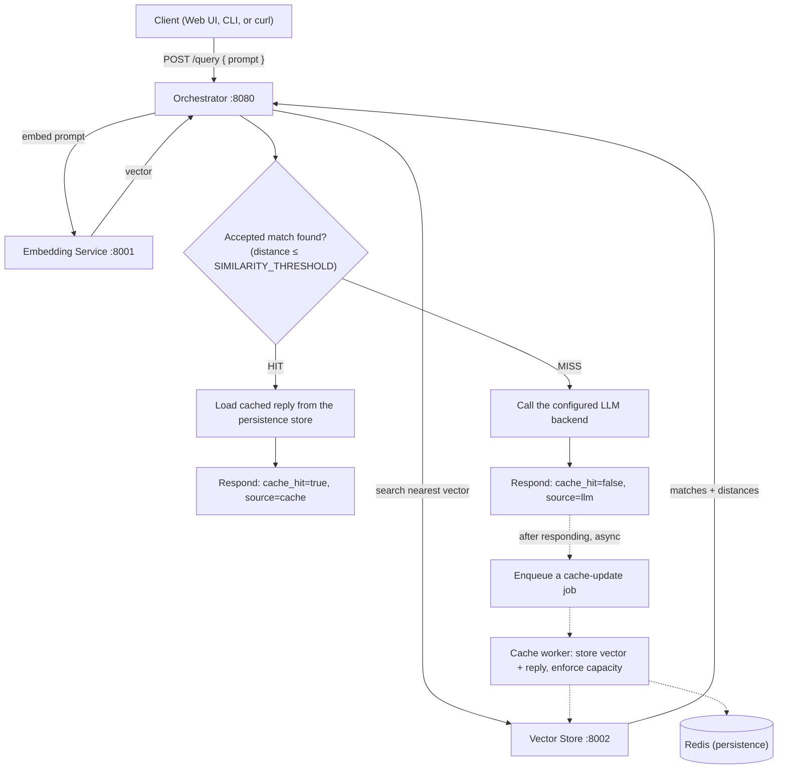

# LLM Semantic Cache — User Guide

This guide explains how to install, configure, run, and use the LLM Semantic
Cache. It is standalone — you should not need to read anything else first.

If you want to extend the system with a new eviction policy, LLM provider, or
storage backend, see [`docs/EXTENDING.md`](EXTENDING.md) instead; that
material is intentionally not repeated here.

## Table of contents

1. [Overview](#1-overview)
2. [System architecture](#2-system-architecture)
3. [Prerequisites and installation](#3-prerequisites-and-installation)
4. [Configuration](#4-configuration)
5. [Starting and stopping the system](#5-starting-and-stopping-the-system)
6. [Verifying the system](#6-verifying-the-system)
7. [Using the Web UI](#7-using-the-web-ui)
8. [Using the CLI](#8-using-the-cli)
9. [Using the REST API](#9-using-the-rest-api)
10. [Understanding query responses](#10-understanding-query-responses)
11. [Metrics and statistics](#11-metrics-and-statistics)
12. [Cache management](#12-cache-management)
13. [Logging and debugging](#13-logging-and-debugging)
14. [Troubleshooting](#14-troubleshooting)
15. [Extending the system](#15-extending-the-system)
16. [Quick end-to-end example](#16-quick-end-to-end-example)

---

## 1. Overview

The LLM Semantic Cache sits in front of a remote LLM (a large language model
completion API). When a client sends a prompt, the system checks whether it
has already answered a *semantically similar* question before. If it has, it
returns the cached answer immediately, without calling the LLM again. If it
hasn't, it calls the LLM, returns the answer, and stores it for next time.

This matters because LLM calls are typically the slowest and most expensive
part of a system that answers questions with AI: a single call can take
seconds and cost money per request. A cache that recognizes *repeated intent*,
not just repeated exact text, can turn a multi-second, billed LLM call into a
near-instant, free response.

**Cache HIT vs. cache MISS**

- A **HIT** means the system found a previously cached reply for a question
  close enough in meaning to the new one. The cached reply is returned
  immediately; the LLM is never called.
- A **MISS** means no sufficiently similar question was found in the cache.
  The system calls the LLM, returns its answer, and (in the background) stores
  the new question/answer pair so a similar future question can hit the cache.

**Semantic similarity and distance**

Unlike a simple key-value cache (which only matches identical text), this
system converts each prompt into a numerical vector (an *embedding*) that
represents its meaning. Two prompts that mean the same thing — even if worded
differently — produce vectors that are close together. "Explain what virtual
memory is" and "What is virtual memory?" produce nearly identical vectors.

The system measures how close two vectors are with a **distance**: `0.0`
means an exact/identical match, and larger values mean less similarity. A
question only counts as a cache HIT if its distance to the closest cached
question is at or below a configurable threshold (`SIMILARITY_THRESHOLD`,
see [Configuration](#4-configuration)). On a MISS, there is no accepted match,
and the API represents this with a distance of `-1` (see
[Understanding query responses](#10-understanding-query-responses)).

## 2. System architecture

The system is composed of four independently deployable components, each
running in its own container:

| Component | Language | Port | Responsibility |
|---|---|---|---|
| Orchestrator | Go | `8080` | Coordinates the whole request: talks to the embedding service, the vector store, the LLM, and Redis. This is the only component clients talk to directly. |
| Embedding Service | Python | `8001` | Converts a text prompt into a numerical vector using a sentence-embedding model. |
| Vector Store | Python | `8002` | Stores vectors and finds the nearest previously-seen vector to a new one. |
| Redis | — | `6379` | Durable storage for cached prompt/reply pairs, the asynchronous cache-update queue, and the source of truth used to rebuild the vector index after a restart. |

The LLM itself is a pluggable backend selected by configuration (a local
`stub` by default, or a real provider such as OpenAI or Gemini) — see
[Configuration](#4-configuration).

### Request flow



Solid arrows are synchronous — they happen before the client gets a response.
Dashed arrows happen **after** the response has already been sent on a MISS:
the orchestrator enqueues the new prompt/vector/reply for a background worker,
which stores it in the vector store and Redis and enforces the configured
cache capacity (evicting an older entry if needed). This means a MISS response
is not slowed down by the write, but also that the entry is not guaranteed to
be searchable for a query that arrives in the same instant.

## 3. Prerequisites and installation

You need:

- **Git**, to clone the repository.
- **Docker Desktop** (or Docker Engine + the Compose plugin) — every service
  runs in a container, so you do not need Go or Python installed locally to
  run the system.

No other tools are required to run the project.

```bash
git clone https://github.com/Leenkabha/LLM_CACHE.git
cd LLM_CACHE
```

Create your local configuration file from the provided template:

```bash
cp .env.example .env
```

The defaults in `.env.example` work out of the box with no changes — the
default LLM backend (`stub`) requires no API key and makes no network calls.

## 4. Configuration

Configuration is read from environment variables (`internal/config/config.go`),
populated from `.env` when running via `docker-compose.yml`. This section
documents the operator-facing settings — the ones you tune to run the system
a certain way. If you want to *add* a new backend implementation rather than
select among the existing ones, see `docs/EXTENDING.md`.

| Variable | Default | Valid values | What changing it means |
|---|---|---|---|
| `SIMILARITY_THRESHOLD` | `0.25` | any number | The maximum distance a match may have and still count as a cache HIT. Lower = stricter (fewer, more precise hits); higher = looser (more hits, but some may be topically unrelated). |
| `CACHE_TOP_K` | `1` | integer ≥ 1 | How many of the nearest cached matches `/query` may return in `results`. `1` returns only the single best match; a higher value lets a client see and compare several close candidates. Startup fails if this is not a positive integer. |
| `CACHE_CAPACITY` | `1000` | integer | Maximum number of cached prompt/reply entries kept at once. When exceeded, the active eviction policy chooses an entry to remove. Setting this to `0` or a negative number **disables eviction entirely** — the cache grows without bound. |
| `CACHE_POLICY` | `lru` | `lru`, `lfu`, `fifo` | Which entry is evicted when capacity is exceeded: least-recently-used, least-frequently-used, or first-in-first-out. Changing this only takes effect on restart — it cannot be switched live (see [Cache management](#12-cache-management)). |
| `LLM_MODE` | `stub` | `stub`, `openai`, `gemini`, `example-http` | Which backend answers cache misses. `stub` returns a canned placeholder reply with no network access — useful for local development. `openai`/`gemini` call a real provider (requires the matching API key below). `example-http` is a template adapter documented in `docs/EXTENDING.md`. |
| `LLM_FALLBACK_MODE` | *(empty)* | any registered `LLM_MODE` name, or empty | If set, a failure of the primary `LLM_MODE` backend (for any reason other than the client canceling the request) is retried against this backend instead of failing the request. Leaving it empty means a primary failure fails the request. |
| `OPENAI_API_KEY` / `OPENAI_MODEL` | *(empty)* / `gpt-4o-mini` | — | Credentials/model for `LLM_MODE=openai`. |
| `GEMINI_API_KEY` / `GEMINI_MODEL` | *(empty)* / `gemini-flash-latest` | — | Credentials/model for `LLM_MODE=gemini`. |
| `EMBEDDING_BACKEND` | `http` | `http` | The orchestrator's client adapter for talking to the embedding service. Only `http` is currently registered. |
| `VECTORSTORE_BACKEND` | `http` | `http` | The orchestrator's client adapter for talking to the vector store service. Only `http` is currently registered. |
| `PERSISTENCE_BACKEND` | `redis` | `redis`, `memory` | Where cached prompt/reply entries are durably stored. `memory` keeps them only in the orchestrator process (lost on restart) — mainly useful for local testing without Redis. |
| `QUEUE_BACKEND` | `redis` | `redis` | The mechanism used to hand a cache-miss's prompt/reply to the background cache-update worker. Only `redis` (Redis Streams) is currently registered. |
| `EMBEDDING_MODEL_BACKEND` | `sentence-transformers` | `sentence-transformers` | The embedding-model engine used **inside** the embedding service container (distinct from `EMBEDDING_BACKEND`, which is the orchestrator's client). |
| `EMBEDDING_MODEL` | `all-MiniLM-L6-v2` | any model name supported by the configured backend | The concrete sentence-embedding model loaded on startup. |
| `VECTOR_INDEX_BACKEND` | `faiss` | `faiss` | The vector-index engine used **inside** the vector store service container. |
| `SIMILARITY_METRIC` | `cosine` | `cosine`, `euclidean` | How distance between two vectors is computed. Must suit the embedding model in use. |
| `VECTOR_DIM` | `384` | integer | The dimensionality of vectors the index expects. Must equal the configured embedding model's actual output size. |
| `LOG_FILE` | `logs/orchestrator.log` | any file path, or empty | Where orchestrator logs are additionally written (see [Logging](#13-logging-and-debugging)). Leaving it empty logs to stdout only. |

An unrecognized value for any backend-selector variable (e.g. a typo in
`CACHE_POLICY`) causes the orchestrator to fail immediately at startup with an
error listing the names that *are* registered — it does not silently fall
back to a default.

## 5. Starting and stopping the system

Build and start all four services in the background:

```bash
docker compose up --build -d
```

This starts the `orchestrator`, `embedding`, `vectorstore`, and `redis`
services. The first run downloads dependencies and can take several minutes,
particularly for the embedding service (it installs a real sentence-embedding
model).

Stop the containers but keep their state (Redis data, images):

```bash
docker compose stop
```

Stop and remove the containers entirely:

```bash
docker compose down
```

Restart just the orchestrator (for example, after editing `.env`) by
recreating it so it picks up the new environment values — a plain
`docker compose restart` reuses the old environment and will **not** see
`.env` changes:

```bash
docker compose up -d orchestrator
```

## 6. Verifying the system

Each service exposes a health check, but they are not identical.

The embedding and vector store services each expose a plain liveness check
with no dependency awareness:

```bash
curl -s localhost:8001/health
curl -s localhost:8002/health
```

Both return, when running:

```json
{"status":"ok"}
```

The orchestrator exposes a **dependency-aware** health check that in turn
verifies the embedding service, the vector store, and Redis are all reachable:

```bash
curl -s localhost:8080/health
```

When every dependency is healthy (HTTP 200):

```json
{
  "status": "ok",
  "checks": {
    "embedding": "ok",
    "vectorstore": "ok",
    "redis": "ok"
  }
}
```

If any dependency is unreachable, the orchestrator responds with HTTP 503 and
`"status": "degraded"`, and the failing check's value is replaced with the
underlying error message instead of `"ok"` — for example
`"embedding": "context deadline exceeded"`. Each dependency is checked with
its own independent timeout, so one slow service cannot falsely mark a
healthy one as failed.

## 7. Using the Web UI

The orchestrator serves a built-in web UI at the exact root URL:

```
http://localhost:8080/
```

(only `GET /` serves it; any other path is handled by the API, not the UI.)

The UI is a single page (`internal/orchestrator/web/index.html`) with:

- A text box to type a question, and an **Ask** button (or press
  <kbd>Cmd/Ctrl</kbd>+<kbd>Enter</kbd> while typing).
- While a request is in flight, the button shows a spinner and reads
  "Asking…", and the result area shows a plain "Asking…" placeholder.
- On success, a result card shows:
  - A pill labeled **Cache hit** or **Cache miss**.
  - `source`, `distance`, and `latency` (in ms) for that request.
    Distance is shown to 4 decimal places, or as `—` when the response's
    distance is negative (i.e., on a MISS).
  - The reply text.
  - If more than one result was returned (`CACHE_TOP_K` > 1 and multiple
    matches qualified), an **"All matches (Top-K)"** list showing each
    result's rank, reply text, and distance.
- On failure (a non-2xx response, or the orchestrator being unreachable), the
  result area shows a red error card with the server's error message or a
  network-error message.

The UI only submits queries — as of the current implementation it does
**not** include a flush button, a metrics/stats dashboard, or a policy
selector. Use the CLI or REST API directly for those (see below).

## 8. Using the CLI

The repository includes a small command-line client at `cmd/cli/main.go`.

**Running it locally** (requires Go, or use the containerized form below):

```bash
go run ./cmd/cli <command> [args]
```

**Running it via Docker Compose**, without installing Go, using the `cli`
service (which is only started on demand via its `tools` profile):

```bash
docker compose run --rm cli query "What is virtual memory?"
```

The CLI talks to the orchestrator URL in the `ORCH_URL` environment variable,
defaulting to `http://localhost:8080` when run locally. (Inside the Compose
network, the `cli` service is preconfigured with `ORCH_URL=http://orchestrator:8080`.)

The CLI supports exactly these commands:

| Command | Example | Purpose |
|---|---|---|
| `query "<prompt>"` | `cli query "What is virtual memory?"` | Submit a prompt and print the reply plus a `[source=... cache_hit=... distance=... latency=...ms]` summary line. If more than one Top-K result came back, each is printed numbered with its own reply, id, and distance. |
| `stats` | `cli stats` | Fetch and pretty-print `/stats` as JSON. |
| `flush` | `cli flush` | Wipe the cache (`POST /flush`) and print the response. |
| `policy <name>` | `cli policy lru` | Attempt to switch the active eviction policy (`POST /policy`). |

Any other or missing command prints a usage message and exits with a
non-zero status.

## 9. Using the REST API

All endpoints are served by the orchestrator on port `8080`.

### `POST /query`

Submit a prompt. Body:

```json
{"prompt": "What is virtual memory?"}
```

Example:

```bash
curl -s localhost:8080/query \
  -H "Content-Type: application/json" \
  -d '{"prompt":"What is virtual memory?"}'
```

Response (see [Understanding query responses](#10-understanding-query-responses)
for field semantics):

```json
{
  "results": [],
  "reply": "[stub-llm] This is a placeholder reply for: \"What is virtual memory?\"",
  "cache_hit": false,
  "distance": -1,
  "latency_ms": 38,
  "source": "llm"
}
```

An empty or missing `prompt` returns HTTP 400. A failure reaching the
embedding service, the vector store, or the LLM returns HTTP 502 with a body
like `{"error": "embedding failed: ..."}` (the message names which step
failed).

### `GET /stats`

Returns current cache metrics (see [Metrics and statistics](#11-metrics-and-statistics)).

```bash
curl -s localhost:8080/stats
```

### `POST /flush`

Wipes the cache. No request body is needed.

```bash
curl -s -X POST localhost:8080/flush
```

```json
{"status": "flushed"}
```

### `POST /policy`

Attempt to change the active eviction policy. Body:

```json
{"policy": "lru"}
```

```bash
curl -s -X POST localhost:8080/policy \
  -H "Content-Type: application/json" \
  -d '{"policy":"lru"}'
```

On success: `{"status": "ok", "policy": "lru"}`. See
[Cache management](#12-cache-management) for exactly when this succeeds.

### `GET /health`

See [Verifying the system](#6-verifying-the-system).

## 10. Understanding query responses

`POST /query` returns:

| Field | Meaning |
|---|---|
| `reply` | The answer text — either the cached reply (HIT) or the LLM's fresh completion (MISS). |
| `cache_hit` | `true` if served from the cache, `false` if the LLM was called. |
| `distance` | How similar the prompt was to the best matched cached prompt. `0.0` means an exact/identical match; larger values mean less similarity. **On a MISS, this is always exactly `-1`** — there is no meaningful distance because no cached match was accepted. |
| `latency_ms` | Total time to handle the request, in milliseconds, measured from when the orchestrator received it. |
| `source` | `"cache"` or `"llm"` — which path produced `reply`. |
| `results` | An array of up to `CACHE_TOP_K` matches, each `{"id", "reply", "distance"}`, ordered by ascending distance (best first). **Empty (`[]`) on a MISS.** On a HIT, `reply` and `distance` at the top level always mirror `results[0]` (the best match); `results` may contain fewer than `CACHE_TOP_K` entries if some matched vector IDs no longer have a corresponding stored reply. |

## 11. Metrics and statistics

`GET /stats` returns:

```json
{
  "requests": 100,
  "hits": 63,
  "misses": 37,
  "hit_rate": 0.63,
  "avg_hit_latency_ms": 5.2,
  "avg_miss_latency_ms": 431.7,
  "avg_hit_distance": 0.031,
  "evictions": 12,
  "size": 63,
  "policy": "lru"
}
```

| Field | Meaning |
|---|---|
| `requests` | `hits + misses`. A request is only counted once embedding and vector search both succeed and a HIT/MISS outcome is actually determined — a request that fails earlier (bad input, an unreachable embedding/vector service) is not counted here at all. |
| `hits` | Number of queries served from the cache. Counted once per query, regardless of how many Top-K results were returned for it. |
| `misses` | Number of queries that reached the LLM successfully. |
| `hit_rate` | `hits / requests`, or `0` if there have been no requests yet. |
| `avg_hit_latency_ms` | Average `latency_ms` across all HIT responses. `0` until at least one hit has occurred. |
| `avg_miss_latency_ms` | Average `latency_ms` across all MISS responses. `0` until at least one miss has occurred. |
| `avg_hit_distance` | Average of the **best accepted match's** distance for each HIT query — exactly one distance value contributed per hit, even when `results` contains several Top-K matches. `0` until at least one hit has occurred. |
| `evictions` | Number of cache entries actually removed (from both the vector store and the persistence store) to enforce `CACHE_CAPACITY`. A failed eviction attempt is not counted until it eventually succeeds. |
| `size` | Current number of entries in the persistence store. |
| `policy` | The currently active eviction policy name. |

All of these counters are reset to zero by `/flush` (see next section), and
are tracked independently of which persistence backend, LLM backend, or
eviction policy is selected.

## 12. Cache management

**Flushing the cache** (`POST /flush`) clears:

- Every stored vector in the vector store.
- Every stored prompt/reply entry in the persistence store.
- All eviction-policy metadata (e.g. LRU recency, LFU frequency counts).
- Every `/stats` counter listed above (back to `0`).

If clearing the vector store itself fails, the endpoint returns HTTP 502 and
**none** of the above is reset — flush is only considered to have happened
once the vector store confirms it.

**Changing the eviction policy at runtime is intentionally not supported.**
`POST /policy` only succeeds (HTTP 200) when the requested policy name is
already the active one — it acts as a no-op confirmation, not a switch. If
you request:
- an **unregistered** name, you get HTTP 400 with an error listing the
  registered policy names.
- a **different, valid** policy name, you get HTTP 400 telling you to set
  `CACHE_POLICY` in your environment and restart instead.

To actually change policy: edit `CACHE_POLICY` in `.env`, then recreate the
orchestrator (`docker compose up -d orchestrator`). This restriction exists
because each policy (LRU, LFU) keeps different kinds of metadata about each
entry, and there is no way to reconstruct one from the other without losing
information.

**Capacity and eviction.** `CACHE_CAPACITY` is checked after every new entry
is cached (i.e., after a MISS's background cache-update job completes), not
on every hit. If the number of entries exceeds capacity, the active policy is
asked to pick a victim, which is removed from both the vector store and the
persistence store before capacity is re-checked (so more than one entry can
be evicted in a single pass if needed). Setting `CACHE_CAPACITY` to `0` or a
negative number disables this check entirely, so the cache grows without
bound.

## 13. Logging and debugging

The orchestrator always logs plain-text lines to stdout (timestamps in UTC,
microsecond precision) — startup configuration, every cache hit/miss/eviction,
flush/policy requests, and errors reaching downstream services.

If `LOG_FILE` is set (default: `logs/orchestrator.log`), the same output is
**also** appended to that file inside the container; leaving `LOG_FILE` empty
disables file logging (stdout only). In the provided `docker-compose.yml`,
the orchestrator's `/app/logs` directory is mounted to `./logs` on the host,
so with the default `LOG_FILE` value you can read the log file directly at
`./logs/orchestrator.log` without entering the container.

To inspect logs for any service through Docker instead:

```bash
docker compose logs orchestrator
docker compose logs embedding
docker compose logs vectorstore
docker compose logs -f orchestrator   # follow in real time
```

## 14. Troubleshooting

| Symptom | Likely cause / what to check |
|---|---|
| A service fails to start / exits immediately | Run `docker compose ps` to see its status, then `docker compose logs <service>` for the actual error. An invalid backend-selector value (e.g. a typo in `CACHE_POLICY` or `LLM_MODE`) makes the orchestrator fail fast at startup with a message listing the valid registered names — check for that first. |
| `GET /health` returns `"status": "degraded"` (HTTP 503) | One of `embedding`, `vectorstore`, or `redis` is unreachable — the response's `checks` object shows the actual error for the failing one. Confirm that service is up (`docker compose ps`) and check its logs. |
| `curl localhost:8001/health` or `:8002/health` fails right after `docker compose up` | The embedding service loads a real sentence-transformers model on boot, which can take tens of seconds after the container reports started. Wait and retry, or watch `docker compose logs embedding` for "Application startup complete." |
| `/query` returns HTTP 400 `"missing or invalid prompt"` | The request body is missing, not valid JSON, or has an empty `"prompt"` field. |
| `/query` returns HTTP 502 `"embedding failed: ..."` or `"vector search failed: ..."` | The orchestrator could reach neither respective downstream Python service, or that service returned an error. Check `EMBEDDING_URL`/`VECTORSTORE_URL` and that service's logs. |
| `/query` returns HTTP 502 `"llm failed: ..."` | The configured LLM backend failed. For `openai`/`gemini`, check that the matching `*_API_KEY` is set and valid; the underlying provider error is included in the message. Consider setting `LLM_FALLBACK_MODE` (e.g. to `stub`) to keep the endpoint responding, though it will not use your intended provider until the root cause is fixed. |
| `/policy` always returns HTTP 400 | Switching to a different policy at runtime is rejected by design — see [Cache management](#12-cache-management). Change `CACHE_POLICY` and restart the orchestrator instead. |
| Config changes in `.env` don't seem to take effect | `docker compose restart` reuses the container's existing environment. After editing `.env`, run `docker compose up -d orchestrator` (or `docker compose up -d` for all services) to recreate the container with the new values. |

## 15. Extending the system

The orchestrator and both Python services are built around pluggable
interfaces: eviction policy, LLM backend, embedding client, vector-store
client, persistence backend, update queue, and (inside the Python services)
the embedding model, vector index engine, and similarity metric. New
implementations register themselves without modifying existing code.

This guide intentionally does not cover how to build one. For interface
contracts, the registration mechanism, worked examples for adding a new
eviction policy or LLM provider, guidance on persistence/queue and
embedding/vector/similarity plugins, and the reusable contract tests for
verifying a new implementation, see **[`docs/EXTENDING.md`](EXTENDING.md)**.

## 16. Quick end-to-end example

```bash
# 1. Start everything
docker compose up --build -d

# 2. Wait for it, then confirm it's healthy
curl -s localhost:8080/health

# 3. Send a first query (open http://localhost:8080/ in a browser instead,
#    if you prefer the Web UI)
curl -s localhost:8080/query -H "Content-Type: application/json" \
  -d '{"prompt":"What is virtual memory?"}'
# -> "cache_hit": false, "distance": -1, "source": "llm"  (a MISS)

# 4. Ask a semantically similar (or identical) question again
curl -s localhost:8080/query -H "Content-Type: application/json" \
  -d '{"prompt":"Can you explain what virtual memory is?"}'
# -> "cache_hit": true, "source": "cache", much lower "latency_ms"  (a HIT)

# 5. Check aggregate metrics
curl -s localhost:8080/stats

# 6. Optionally, reset everything for a clean slate
curl -s -X POST localhost:8080/flush
```
